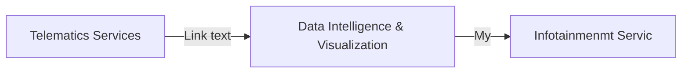

# Automotive Functional Safety Compliance

After I have written the "Automotive Functional Safety Cmpliance" E-Book of the intland. I gain for informatin about the functional safety compliance with ISO26262.

# Why we need functional safty in vehicles?

<!--stackedit_data:
eyJoaXN0b3J5IjpbNzc5Mjc2NDE0LC0zNDYyNzY0NTYsNzk1OD
E2MDE2LC00NDA4OTQ0MjgsLTkzMTI3NDI2NywzODgzMDMwNzhd
fQ==
-->