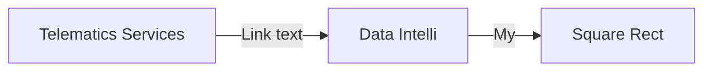

# Automotive Functional Safety Compliance

After I have written the "Automotive Functional Safety Cmpliance" E-Book of the intland. I gain for informatin about the functional safety compliance with ISO26262.

<!--stackedit_data:
eyJoaXN0b3J5IjpbNzk1ODE2MDE2LC00NDA4OTQ0MjgsLTkzMT
I3NDI2NywzODgzMDMwNzhdfQ==
-->