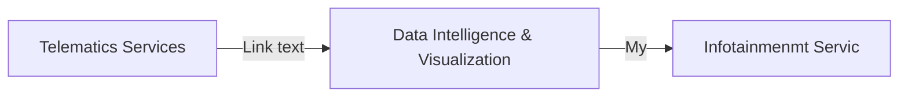

# Automotive Functional Safety Compliance

After I have written the "Automotive Functional Safety Cmpliance" E-Book of the intland. I gain for informatin about the functional safety compliance with ISO26262.

<!--stackedit_data:
eyJoaXN0b3J5IjpbLTM0NjI3NjQ1Niw3OTU4MTYwMTYsLTQ0MD
g5NDQyOCwtOTMxMjc0MjY3LDM4ODMwMzA3OF19
-->