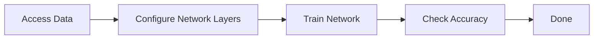
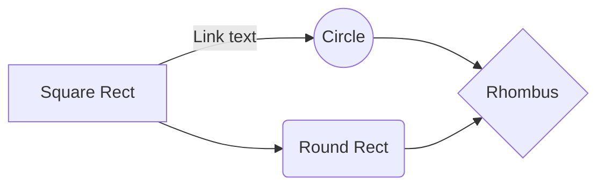

## Machine learning in Matlab

 - Training a network from scratch.
 - Using transfer learning to train on existing network.
 - Training an existing network to perform semantic segmentation.
**In this text we consider these logics for image classification.**

The neural networks which are available in Matlab are as following:

 - LeNet
 - GoogleNet (4)
 - Tensorflow
 - Keras 
 - Yolo 
 - SSD 
 - ResNet
 - AlexNet (1)
 - ResNet
 - VGG 16/19 (2,3)

For using each of them only three four lines are neccessary.

### Training a model from scratch

For developing a model we can use Convolutional neural network (CNN) and we can identify handwritting when a person write a digit.
The second thing that we need is the data, the models use data to learn some thing. More data precizer is the model. One possibility is MNIST dataset.

<!--stackedit_data:
eyJoaXN0b3J5IjpbMzUzODM2NzYwLC00NjMyODY3OCwtMjE1OT
k1NTM0LC0xMzQ5ODQ1MjI2LDE4NTQ5MDI5LDE5MDE5OTA3NTNd
fQ==
-->